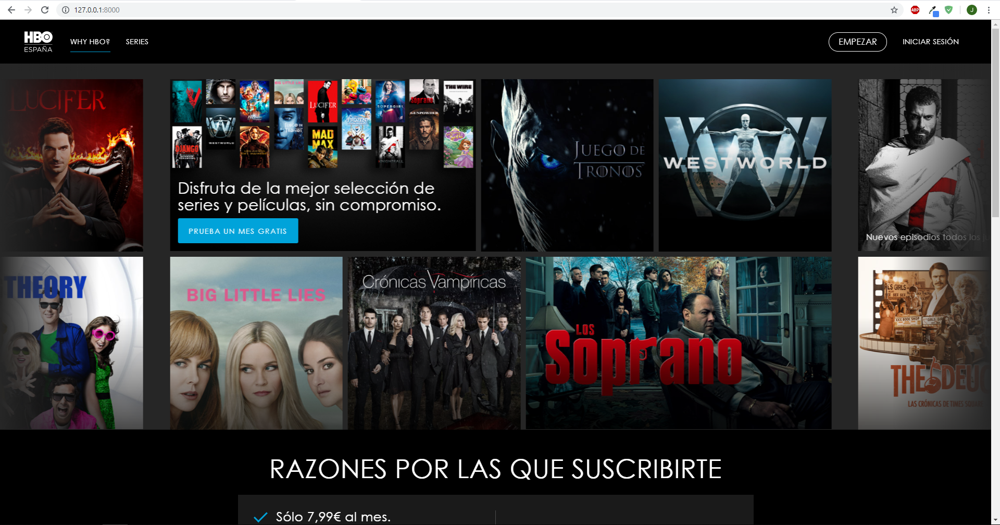
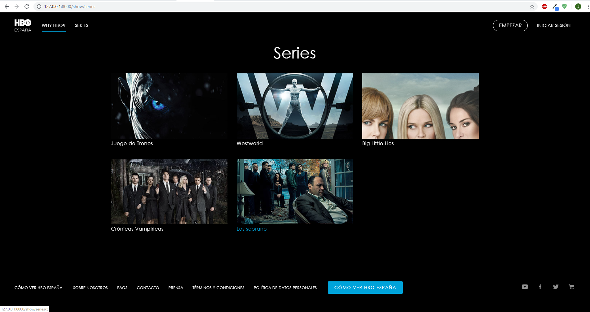
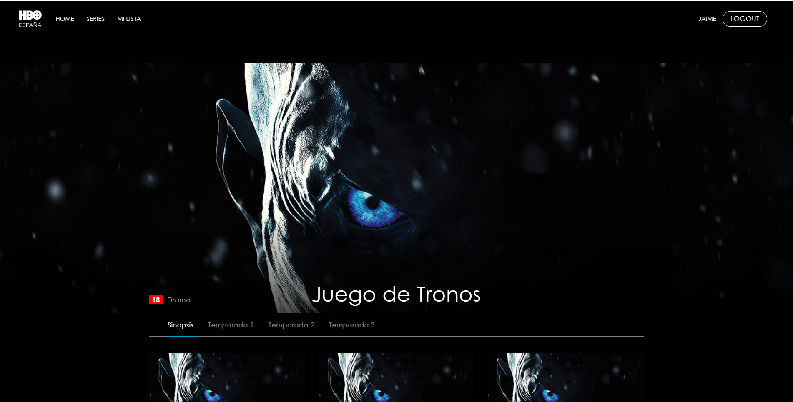
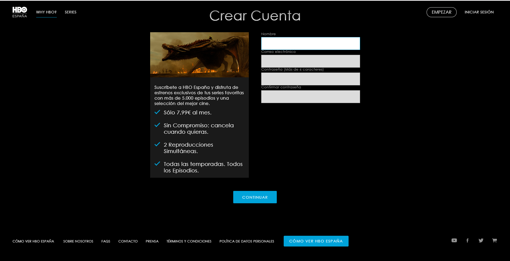

 # Introducción
Esta es una práctica para la asignatura de Ingeniería Web de la [Universidad de Alicante](https://www.ua.es/). La práctica consistía en hacer una pequeña página web con [Laravel](https://laravel.com/), la cual debería ser similar a alguna web que ya existiera, con el fin de intentar replicar algo de lo que desconociamos el código, sus dependencias, clases, etc. En mi caso seleccioné la página de [HBO](https://es.hboespana.com/)

A continuación muestro algunas capturas de la aplicación lograda:

# Guía de despliegue

## Prerrequisitos

- [Composer](https://getcomposer.org/)
> Composer es un administrador de paquetes a nivel de aplicación para el lenguaje de programación PHP que proporciona un formato estándar para administrar las dependencias del software PHP y las bibliotecas requeridas.
- [XAMPP](https://www.apachefriends.org/es/index.html)
> XAMPP es un paquete de software libre, que consiste principalmente en el sistema de gestión de bases de datos MySQL, el servidor web Apache y los intérpretes para lenguajes de script PHP y Perl

## BBDD

Una vez tenemos XAMPP instalado, iremos al administrador de MySQL(Phpmyadmin), y lo que haremos será crear una BBDD con el nombre de hbo, además, crearemos un usuario con su contraseña, en mi caso he elegido: hbo - hbo. 

Es importante acordarnos de estos datos, puesto que hemos de añadir los datos en el .env del proyecto. He añadido un .env.example que es un ejemplo de como debería quedar, recuerda **crearte el tuyo propio.**

## Instalación

Abrimos un terminal en la raiz del proyecto y ejecutamos los siguientes comandos:

`composer install`

`composer update`

`php artisan migrate:refresh --seed` 

> Es posible que tengas que generar tu propia key para el cifrado, con introducir `php artisan key:generate` debería bastar

## Ejecución

Para poner en marcha este proyecto(localhost:8080), desde la carpeta raíz, abrimos un terminal y tecleamos:

`php artisan serve`

## Funcionalidades

Lo que podrás realizar en esta aplicación:
- Registro de usuarios
- Login de usuarios
- Validación de datos
- Listado de series
- Filtros(Series, Peliculas y tu lista)
- Ver los detalles de series
- Ver los detalles de las peliculas
- Opciones de administrador:
  + CRUD Peliculas
  + CRUD Series
  + CRUD Usuarios

# Autores

- [Jaime Sarrión](https://github.com/JaimeSarrion) - [Linkedin](https://www.linkedin.com/in/jaime-sarri%C3%B3n-sahuquillo-b086ba144/)
- [Francisco Javier Falcó](https://github.com/fjfg8)

# Licencias

Este proyecto está bajo la licencia GNU GPL v3 - revisa  [LICENSE](https://github.com/JaimeSarrion/Grandallapp/blob/master/LICENSE)  para ver más detalles.

Laravel es un software de código abierto bajo la licencia  [MIT license](http://opensource.org/licenses/MIT).
